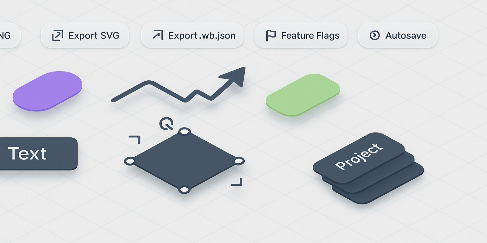
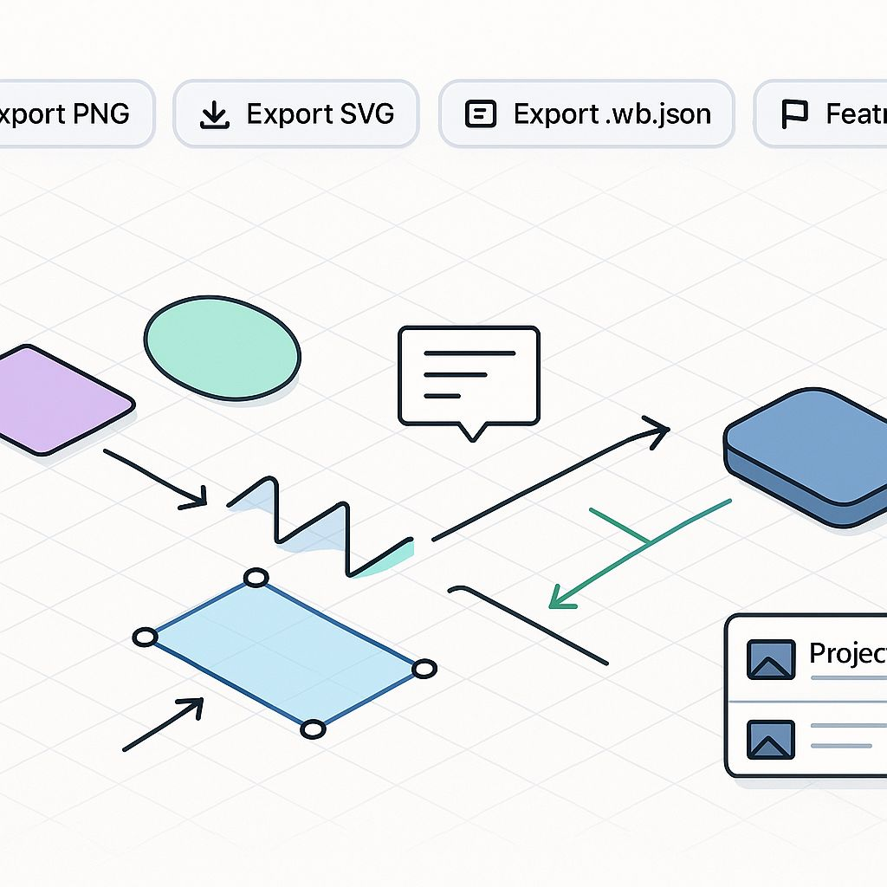

# React Whiteboard Studio

A polished whiteboard experience built to showcase modern front-end engineering craft. Draw blends a high-touch canvas interaction model with a thoughtful state architecture, local persistence, and a curated design system.

## Highlights

- **Fluid Canvas UX** — Pan, zoom, and interact with shapes in real time using keyboard shortcuts, snapping, and transformation handles inspired by professional design tools.
- **Rich Shape Toolkit** — Create rectangles, ellipses, polylines, arrows, paths, and text with inline editing, typography controls, and per-shape styling.
- **Asset Pipeline** — Import images into IndexedDB, reuse them across the canvas, and export the entire project with embedded assets.
- **Project Workspace** — Manage multiple projects locally with autosave, duplication, and lifecycle actions powered by Dexie.
- **Observable & Safe** — Feature flags, error taxonomy, debug overlay, and text sanitization keep experimentation easy and safe.

## Tech Stack

- **React 19** + **TypeScript** for a strongly typed component model.
- **Zustand** (Immer) for focused global state, undo/redo, history, and selectors.
- **Dexie (IndexedDB)** for offline project, document, and asset persistence.
- **Vite** build tooling with Tailwind CSS for rapid UI iteration.
- **React Icons (Lucide)** for a cohesive iconography system.
- **Canvas + Custom Controllers** for pointer-first drawing interactions, including snapping and measurement utilities.

## Functional Tour



Navigate a responsive canvas that marries precision controls with fluid interactions. Tooling stays within reach whether you're sketching a quick storyboard, annotating feedback, or building a polished product diagram.

Compose ideas through layered objects, collaborative annotations, and export-ready assets without leaving the keyboard-driven workflow that keeps momentum high.

- **Toolbar & Context Panel** — Tool switching, typography sliders, alignment controls, and contextual property editing with live commits.
- **Selection & Transform** — Bounding boxes, marquee selection, Figma-style handles, rotation snap (15°), and z-index management.
- **Snapping + Guides** — Grid and object snapping with visual guides and distance labels, toggleable via feature flags.
- **Export / Import** — One-click exports: `.wb.json` bundles, PNG (viewport or selection), SVG with embedded assets; import restores entire projects.
- **Autosave & Flags** — Debounced autosave keeps projects safe; feature flags (URL/localStorage) gate advanced capabilities.
- **Debug Overlay** — Optional overlay exposes fps, shape counts, viewport state, and dirty flags for quick profiling.

## Quick Start

```bash
npm install
npm run dev
```

Visit `http://localhost:5173` (enable `?debug`).

## Architecture Snapshot

- `src/state/` — Global stores (app, history, persistence, projects, errors).
- `src/canvas/` — Canvas viewport, controllers, overlays, snapping utilities.
- `src/ui/` — Toolbar, context panel, project/asset managers, import/export dialogs.
- `src/export/` / `src/import/` — Serialization pipelines for PNG, SVG, JSON.
- `src/persistence/` — Dexie models, adapters, and autosave hooks.
