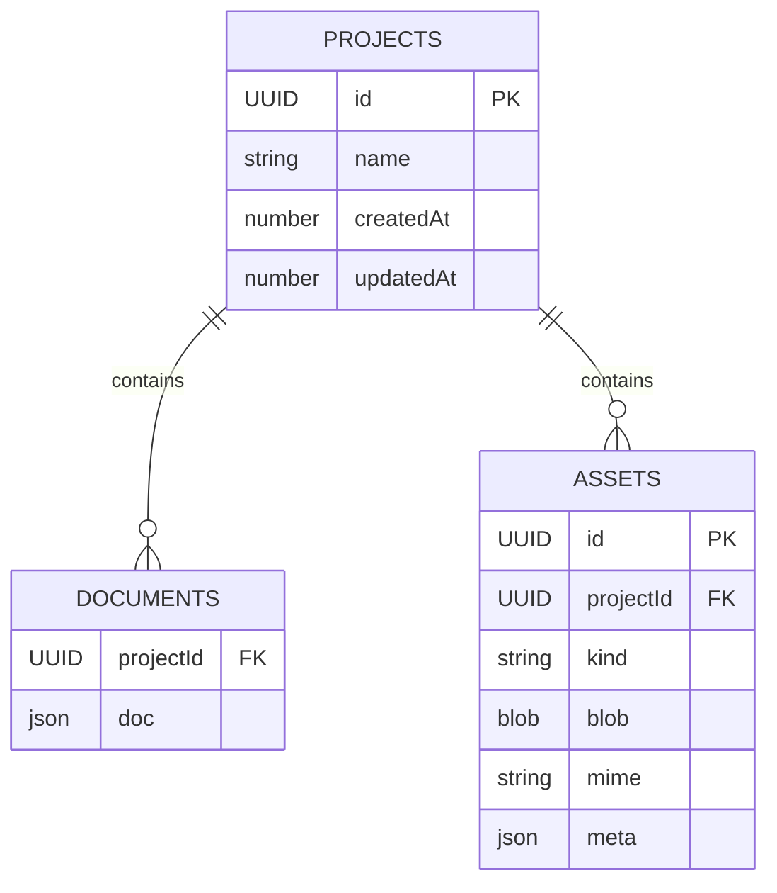
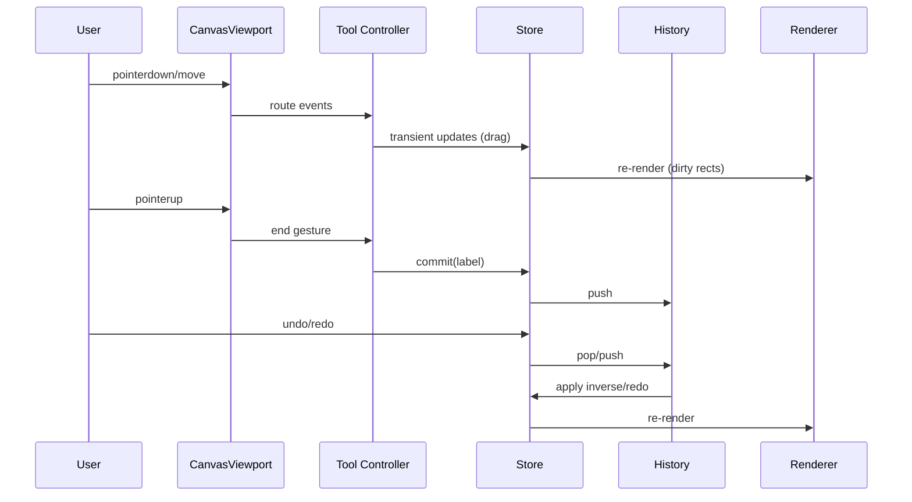

# React Whiteboard – Technical Design (v1)

## 1. Architecture Overview

The application is a client-only, single-page web app built with React + TypeScript. It renders an infinite canvas using Canvas2D via Konva (react-konva) and manages state with Zustand + Immer. Data persists locally to IndexedDB using Dexie, with small settings in localStorage. No backend services or external network calls are used in v1.

Key layers:

- UI and Controls: AppShell, Toolbar, ContextPanel, ProjectManager, AssetManager.
- Viewport and Rendering: CanvasViewport (pan/zoom + event routing), Background/Grid, Shapes Layer, Selection/Guides overlay.
- Domain and State: Store (Zustand), Command History ring buffer, Tool Controllers, Selection/Transform Controller.
- Services: Persistence (Dexie), Asset Service (images/fonts), Export/Import, HitTest, Snap + Guides, Text Measurement Cache.

Build/runtime (assumed from requirements): Vite + TypeScript, Tailwind CSS, ESLint. Optional OffscreenCanvas for PNG export and previews.

## 2. Boundaries and Responsibilities

- AppShell
  - Global theme toggle (light/dark/system), project switcher, keyboard shortcuts registration.
  - Provides application layout and hosts global modals (e.g., import/export dialogs).

- Toolbar
  - Selects active tool; sets style controls (stroke, fill, stroke width, text styling controls).
  - Color pickers and tool presets; communicates via Store actions.

- CanvasViewport
  - Manages world-to-screen transform T = pan + zoom, with clamped zoom [10%, 1600%].
  - Routes pointer/keyboard events to active Tool Controller or Selection/Transform Controller.
  - Schedules rendering (rAF) with dirty-rect updates; shows grid and background patterns.

- ContextPanel
  - Shows and edits properties for current selection; applies changes in real time.

- ProjectManager
  - Lists projects; create/rename/duplicate/delete; pin recent projects.
  - Loads a project’s latest document; coordinates autosave via Persistence.

- AssetManager
  - Manages image and font assets; performs MIME validation; preloads fonts/images for rendering.

- Renderer (react-konva)
  - Layers: Background/Grid, Shapes (batched draw), Selection/Guides overlay, Cursor/Hints.
  - Applies Konva Layer caching, minimizes re-renders via memoization and Store selectors.

- Tool Controllers
  - One per tool (Select, Rect, Ellipse, Line, Arrow, Path, Text, Image).
  - Translate user gestures into domain operations and Store actions; coalesce drags until commit.

- Selection/Transform Controller
  - Computes bounding boxes; draws handles; handles move/resize/rotate with snapping.

- HitTest Service
  - Broad-phase: reverse z-order, optional RBush for >2k shapes.
  - Narrow-phase: AABB then shape-specific checks, with line tolerance = max(6, strokeWidth) screen px.

- Snap + Guides Service
  - Computes snap candidates (grid, edges, centers, angles) and returns snapped positions/angles.
  - Supplies guide lines and distances for overlay rendering.

- Store (Zustand + Immer)
  - Holds shapes, selection, viewport, theme, settings, and command history.
  - Exposes pure actions; side effects are isolated in services/effects.

- Command History (ring buffer)
  - Pushes committed actions (on mouse-up/text apply); supports undo/redo; size N=200 with drag coalescing.

- Persistence (Dexie)
  - IndexedDB tables: projects, documents, assets. Versioned migrations, autosave with 500 ms debounce.

- Export/Import
  - JSON (.wb.json) export with inlined assets (data URLs). PNG/SVG export for view/selection.

- Text Measurement Cache
  - Caches measurement per font/style; ensures stable text layout.

## 3. Data Models and Contracts

Types (from spec; TS notation):

```ts
export type UUID = string

export type Vec2 = { x: number; y: number }
export type RGBA = { r: number; g: number; b: number; a: number }

export type Transform = {
  x: number
  y: number
  scale: number
  rotation: number
}

export type BaseShape = {
  id: UUID
  type: 'rect' | 'ellipse' | 'line' | 'arrow' | 'path' | 'text' | 'image'
  position: Vec2
  rotation: number // degrees
  zIndex: number
  stroke: RGBA
  strokeWidth: number
  fill?: RGBA
  locked?: boolean
  hidden?: boolean
  createdAt: number
  updatedAt: number
}

export type Rect = BaseShape & { type: 'rect'; size: Vec2; radius?: number }
export type Ellipse = BaseShape & { type: 'ellipse'; rx: number; ry: number }
export type Line = BaseShape & { type: 'line'; points: Vec2[] }
export type Arrow = BaseShape & {
  type: 'arrow'
  points: Vec2[]
  headSize: number
}
export type Path = BaseShape & {
  type: 'path'
  d: Vec2[]
  closed?: boolean
  roughness?: number
}
export type TextShape = BaseShape & {
  type: 'text'
  text: string
  box: Vec2 // text box size
  font: { family: string; weight: number; size: number }
  letterSpacing?: number
  lineHeight?: number
  align?: 'left' | 'center' | 'right'
  italic?: boolean
  underline?: boolean
  shadow?: { offset: Vec2; blur: number; color: RGBA }
}
export type ImageShape = BaseShape & {
  type: 'image'
  size: Vec2
  assetId: UUID
  objectFit?: 'contain' | 'cover'
}

export type Shape =
  | Rect
  | Ellipse
  | Line
  | Arrow
  | Path
  | TextShape
  | ImageShape

export type DocumentV1 = {
  id: UUID
  name: string
  shapes: Shape[]
  viewport: Transform
  theme: 'light' | 'dark' | 'system'
  version: 1
}

export type ProjectMeta = {
  id: UUID
  name: string
  createdAt: number
  updatedAt: number
}
```

Dexie (IndexedDB) schema:

- projects: `{ id: UUID, name: string, createdAt: number, updatedAt: number }`
- documents: `{ projectId: UUID, doc: DocumentV1 }`
- assets: `{ id: UUID, projectId: UUID, kind: 'image' | 'font', blob: Blob, mime: string, meta?: any }`

Export file contract:

```ts
export type ExportWBJsonV1 = {
  document: DocumentV1
  assets: Record<UUID, { dataUrl: string; mime: string; meta?: any }>
  formatVersion: 1
}
```

## 4. APIs and Endpoints

No network endpoints in v1. Public API is internal module boundaries:

Store API (subset):

```ts
export type Tool =
  | 'select'
  | 'rect'
  | 'ellipse'
  | 'line'
  | 'arrow'
  | 'path'
  | 'text'
  | 'image'

export interface AppState {
  document: DocumentV1
  selection: UUID[]
  activeTool: Tool
  viewport: Transform
  settings: { gridVisible: boolean; snapEnabled: boolean }
}

export interface Actions {
  setTool(tool: Tool): void
  setViewport(update: Partial<Transform>): void // clamps scale
  addShape(shape: Shape): void
  updateShape(id: UUID, updater: (s: Shape) => void): void
  deleteShapes(ids: UUID[]): void
  select(ids: UUID[], mode: 'set' | 'add' | 'toggle'): void
  transformSelection(tx: Partial<Transform>): void // move/rotate/scale
  commit(label: string): void // push to history
  undo(): void
  redo(): void
}
```

Persistence API:

```ts
export interface Persistence {
  listProjects(): Promise<ProjectMeta[]>
  createProject(name: string): Promise<ProjectMeta>
  renameProject(id: UUID, name: string): Promise<void>
  duplicateProject(id: UUID): Promise<ProjectMeta>
  deleteProject(id: UUID): Promise<void>

  loadDocument(projectId: UUID): Promise<DocumentV1 | null>
  saveDocument(projectId: UUID, doc: DocumentV1): Promise<void>

  putAsset(a: {
    id: UUID
    projectId: UUID
    kind: 'image' | 'font'
    blob: Blob
    mime: string
    meta?: any
  }): Promise<void>
  getAsset(id: UUID): Promise<{ blob: Blob; mime: string; meta?: any } | null>
}
```

Export/Import API:

```ts
export interface Exporter {
  exportWBJson(doc: DocumentV1, assets: Persistence): Promise<ExportWBJsonV1>
  exportPNG(
    view: 'viewport' | { selection: UUID[] },
    scale?: number,
  ): Promise<Blob>
  exportSVG(view: 'viewport' | { selection: UUID[] }): Promise<Blob>
}

export interface Importer {
  importWBJson(file: File, persistence: Persistence): Promise<DocumentV1>
}
```

Error taxonomy:

```ts
export type AppErrorCode =
  | 'PersistenceError'
  | 'ValidationError'
  | 'AssetError'
  | 'ImportError'
  | 'ExportError'
  | 'Unsupported'

export class AppError extends Error {
  constructor(
    public code: AppErrorCode,
    message: string,
    public cause?: unknown,
    public data?: any,
  ) {
    super(message)
  }
}
```

## 5. State Management and Side Effects

- Zustand store with Immer produces immutable updates; components subscribe with selector functions to minimize renders.
- Command History ring buffer stores inverse operations or snapshots for undo/redo; drag operations coalesce to a single commit on mouse-up.
- Autosave effect debounced at 500 ms after state changes that mutate the document; guarded by dirty flag.
- Tool Controllers handle pointerdown/move/up, writing transient state during drag and calling `commit()` at the end.
- Font and image asset loads occur via AssetManager; images cache to object URLs; fonts preload with CSS Font Loading API when available.
- PNG export uses OffscreenCanvas when supported; falls back to on-thread Canvas snapshot.

## 6. Failure Modes, Retries, Timeouts, Idempotency

- IndexedDB failures (quota, blocked, migration):
  - Detect via Dexie errors; surface user-friendly messages with retry guidance.
  - On save failure, keep unsaved changes in memory and allow manual export of .wb.json as backup.
- Asset import errors:
  - Validate MIME via file headers when possible; reject non-image types with actionable error.
  - Image decode timeout (e.g., 10s) with cancel; show retry option.
- Export failures:
  - PNG/SVG generation may fail on memory limits; allow lower DPI scale or selection-only export.
- Undo/redo idempotency:
  - Each `commit()` carries a unique id and a reducer patch; repeated undo/redo yields the same state.
- Gesture cancellation:
  - Escape cancels current tool operation and discards transient state; no commit is added.

## 7. Security and Privacy Controls

- Text sanitization:
  - Sanitize pasted/typed rich content before insertion (e.g., DOMPurify-like approach) to strip scripts/unsafe HTML. Text shapes store plain text + styles.
- Asset restrictions:
  - Accept only image MIME types (e.g., image/png, image/jpeg, image/webp, image/svg+xml); disallow others.
- Network policy:
  - No external network calls by default; all processing local to device.
- Secrets:
  - None stored; no credentials required.
- Privacy:
  - All data remains on-device in IndexedDB/localStorage; exports embed assets explicitly.

## 8. Performance Targets and Budgets

- TTFD (time to first draw): ≤ 800 ms for ≤ 100 shapes on typical laptop.
- Interaction FPS: ≥ 30 FPS for drag of ~1,000 simple shapes.
- Pointer event throttle: ~60 Hz during interaction frames.
- RBush threshold: enable spatial index when shapes > 2,000; otherwise reverse z-order scan.
- Text measurement cache hit rate: ≥ 90% during steady-state edits.
- PNG export uses OffscreenCanvas to avoid UI jank; fallback path blocks the UI for ≤ 1s on typical scenes.

## 9. Observability

- Dev-mode logs: gate via `?debug` flag; structured console logs for persistence and exports.
- Performance marks: use `performance.mark/measure` around draw loops, hit tests, exports.
- Debug overlay (optional dev tool): shows FPS, dirty-rect count, snap hits, and selection bounds.
- No telemetry or remote metrics in v1; CI performance budgets validate TTFD and drag FPS in E2E.

## 10. Trade-offs and Alternatives

- Rendering: Canvas2D (Konva) chosen over SVG for large-scene performance; WebGL is overkill and increases complexity.
- State: Zustand + Immer vs Redux Toolkit; Zustand has smaller surface and simpler ergonomics for local state.
- Persistence: Dexie vs low-level IDB; Dexie simplifies migrations and queries.
- UI primitives: Headless UI vs Radix; either is acceptable—final pick TBD based on bundle size and a11y needs.
- Spatial index: RBush adds overhead; enabled only beyond shape-count threshold.
- Text engine: Browser text measurement with caching; avoids custom layout engine complexity.

## 11. Diagrams (Mermaid)

Flowchart – Event to Render

```mermaid
flowchart LR
  P[Pointer/Keyboard] --> V[CanvasViewport]
  V -->|route| T[Tool Controller]
  V -->|route selection| S[Selection/Transform]
  T -->|actions| ST[Store]
  S -->|actions| ST
  ST -->|state change| R[Renderer (Konva)]
  V --> H[HitTest]
  H --> T
  ST --> PR[Persistence (autosave)]
```

ER Diagram – Local Persistence



Sequence – Edit, Commit, Undo



## 12. Traceability to Acceptance Criteria

- AC-zoom-01: CanvasViewport `setViewport({ scale })` clamps zoom; zoom-to-cursor logic in Viewport.
- AC-pan-01: Space+drag handled in CanvasViewport with panning mode.
- AC-tools-01: Tool Controllers (Rect/Ellipse/Line/Arrow/Path/Text/Image) create shapes with defaults.
- AC-select-01: HitTest + Selection/Transform Controller; marquee selection and Shift toggles.
- AC-transform-01: Selection/Transform Controller handles resize with Shift aspect lock and rotate snap (15°).
- AC-text-01: Text Tool + Text Measurement Cache; ContextPanel applies styles in real time.
- AC-snap-01: Snap + Guides Service provides grid/object/angle snapping and overlays.
- AC-import-01: Importer parses .wb.json and repopulates DocumentV1 + assets.
- AC-export-01: Exporter outputs PNG/SVG for viewport/selection with correct styles.
- AC-undo-01: Command History ring buffer with coalesced drags and bounded size N=200.
- AC-projects-01: Persistence lists projects and loads latest autosaved document across reloads.
- AC-theme-01: AppShell theme toggle; Tailwind + CSS variables; canvas content colors unchanged.
- AC-keyboard-01: AppShell/CanvasViewport registers keyboard shortcuts for tool switching.
- AC-security-01: AssetManager MIME validation; Importer rejects non-image assets.
- AC-accessibility-01: Toolbar/controls focusable with ARIA; keyboard nudge in Selection/Transform.

## 13. Context Digest

- docs/requirements.md: Approved requirements including ACs, NFRs, scope, and architecture assumptions.
- docs/description.md: Original technical spec covering tools, data model, interaction model, storage, and performance notes.
- (No code or configs present; conventions inferred from the specs.)
